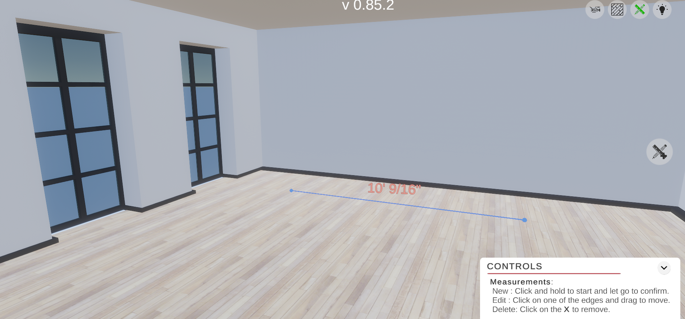
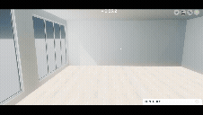

# Unity Room Tools WebGL

**Interactive room measurement and lighting tools in a WebGL demo.**

## Project Summary

- Built as a Unity WebGL MVP for client review of virtual room simulation.
- Demonstrates an interactive ruler measurement tool, texture toggle, and lighting controls inside a single scene.
- Published through GitHub Pages with a lightweight HTML loader and runtime asset streaming.

## Project Overview

This WebGL build loads a Unity room scene with a lower-right UI panel that guides users through the available tools. The demo focuses on a first-version room preview where the primary tool is a ruler for measuring distance, with additional texture and lighting toggles to illustrate virtual space simulation potential.

## Key Features

- ✅ WebGL-hosted Unity room preview
- ✅ Ruler measurement tool for distance visualization
- ✅ Texture toggle support
- ✅ Lighting toggle support
- ✅ On-screen instructions panel in the lower-right UI
- ✅ Client-ready MVP for virtual space simulation

## Preview

Demo: https://abrahamsanchezdev.github.io/unity-room-tools-testing/

## Project Structure

- `index.html` – Unity WebGL loader and responsive canvas wrapper
- `Build/` – compiled Unity WebGL assets (`.unityweb` + loader)
- `StreamingAssets/` – runtime asset folders used by the build
- `TemplateData/` – HTML/CSS shell and styling for the player

## Architecture Highlights

- Unity WebGL export with a JavaScript loader for asset initialization
- UI-driven tool activation and room interaction controls
- Responsive rendering wrapper for browser playback
- Simple scene-based layout optimized as an MVP proof of concept

## Technology Stack

- **Unity** – core authoring and WebGL export
- **WebGL** – browser runtime for the room simulation
- **JavaScript / HTML** – WebGL loader and hosting shell
- **GitHub Pages** – public deployment and demo hosting

## Code Quality and Engineering Practices

- Clear separation between Unity build artifacts and hosting shell
- Maintainable HTML loader with progress handling and mobile viewport support
- Client-focused MVP delivery for fast validation of room tool workflows
- Build output organized for simple GitHub Pages publishing

## Development Insights

- Delivered a focused first version for client review with a single room and ruler tool.
- Prioritized interactivity and visual clarity over broad feature scope.
- Designed as a foundation for future multiple-room and multi-tool simulations.

## Learning Outcomes

- Practiced Unity WebGL deployment and GitHub Pages hosting
- Demonstrated interactive tool design in a browser-based scene
- Validated a proof-of-concept workflow for virtual room measurement and UI controls

## Contact

Repository: https://github.com/AbrahamSanchezDev/unity-room-tools-testing
